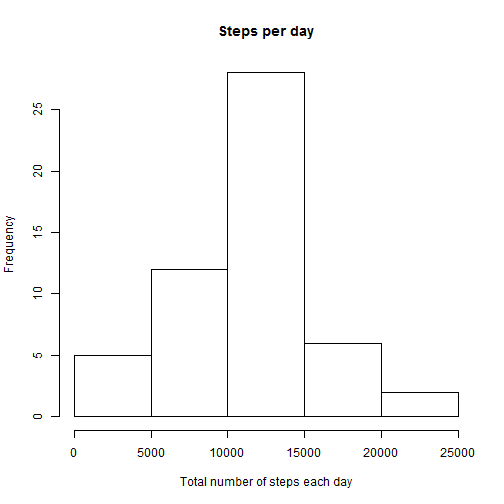

Markdown for Reproducible Research - Assignment 1
=================================================
 
This markdown is for the assignment 1 for the Course Reproducible Research as part of Data Science

Loading and preprocessing the data
----------------------------------

1.  Check if the file exists, else download and unzip and read the data


```r
dlZip <- "repdata_data_activity.zip"
dlTxt <- "activity.csv"

if (!file.exists(dlTxt)) {
    message("CSV file does not exist.. try for zip file")
    if (!file.exists(dlZip)) {
        message("zip file does not exist as well... downloading...")
        download.file("https://d396qusza40orc.cloudfront.net/repdata%2Fdata%2Factivity.zip", 
            dlZip)
    }
    message("extracting text file from zip")
    unzip(dlZip)
}
x <- read.csv("activity.csv")
```


2.  Pre-processing data


```r
y <- x[is.na(x$steps) == FALSE, ]
z <- tapply(y$steps, y$date, sum)
```


What is mean total number of steps taken per day?
-------------------------------------------------
1.  Histogram of the total number of steps taken each day (without NAs)


```r
hist(z, xlab = "Total number of steps each day", main = "Steps per day")
```

 

2.  Calculate and report the mean and median total number of steps taken per day
Mean - total numnber of steps taken per day

```r
mean(z, na.rm = TRUE)
```

```
## [1] 10766
```

Median - total number of steps taken per day

```r
median(z, na.rm = TRUE)
```

```
## [1] 10765
```

What is the average daily activity pattern?
-------------------------------------------
1.  Time series plot of 5 minute interval

```r
zi <- tapply(y$steps, y$interval, mean)
plot(unique(y$interval), zi, type = "l", xlab = "5 min Interval", ylab = "Avg steps across all days")
```

 

2.  Max number of steps for the average across 5 minute intervals.

```r

zid <- as.data.frame(zi)
zid <- cbind(zid, rownames(zid))
zid[order(zid$zi, decreasing = TRUE), ][1, 2]
```

```
## [1] 835
## 288 Levels: 0 10 100 1000 1005 1010 1015 1020 1025 1030 1035 1040 ... 955
```


Inputing missing values
-----------------------

Pre-processing for missing values

1. Number of missing values

```r
cc <- complete.cases(x)
length(cc[which(cc == FALSE)])
```

```
## [1] 2304
```

2. Filling in NAs with mean value across days for the 5 minute interval

- Pre-processing - Creating a separate data frame of all missing values 

```r
xna <- x[which(is.na(x$steps)), ]
yintmean <- tapply(y$steps, y$interval, mean)
yimdf <- as.data.frame(yintmean)
yimdf <- cbind(yimdf, rownames(yimdf))
colnames(yimdf) <- c("intmean", "interval")
xna1 <- merge(xna, yimdf, by.x = "interval", by.y = "interval")
```


- Adding all mean values to the steps column


```r
xna$steps <- xna1$intmean
```


3.  New data set with filled in missing values


```r
ynew <- rbind(y, xna)
```


4.  Hist, mean and median of new data set


```r
hist(tapply(ynew$steps, ynew$date, sum), xlab = "Steps")
```

 


Mean of the new data set per day


```r
mean(tapply(ynew$steps, ynew$date, sum))
```

```
## [1] 10766
```


Median of the new data set per day


```r
median(tapply(ynew$steps, ynew$date, sum))
```

```
## [1] 11015
```


Differences in activity patterns between weekdays and weekends
--------------------------------------------------------------

1.  Creating a new factor variable

```r
wdyn <- weekdays(strptime(ynew$date, format = "%Y-%m-%d"))
wdf <- wdyn %in% c("Saturday", "Sunday")
```


2. Panel plot for weekday and weekend plots

- Creating data of means per time interval for both weekdays and weekends


```r
ynew <- cbind(ynew, wdf)


ynew1 <- split(ynew, ynew$wdf)
wdays <- as.data.frame(ynew1[1])
wend <- as.data.frame(ynew1[2])
wdmean <- tapply(wdays$FALSE.steps, wdays$FALSE.interval, mean)
wemean <- tapply(wend$TRUE.steps, wend$TRUE.interval, mean)
wd <- as.data.frame(wdmean)
we <- as.data.frame(wemean)
wd <- cbind(wd, c("weekday"))
we <- cbind(we, c("weekend"))

colnames(we) <- c("Number of Steps", "daytype")
colnames(wd) <- c("Number of Steps", "daytype")

meanfin <- rbind(we, wd)

meanfin <- cbind(meanfin, rownames(meanfin))
colnames(meanfin)[3] = "Interval"
```


- Using lattice to plot

```r

library(lattice)
xyplot(meanfin$"Number of Steps" ~ meanfin$Interval | meanfin$daytype, data = meanfin, 
    layout = c(1, 2), type = "l", xlab = "Interval", ylab = "Number of Steps ")
```

 

```r

```


